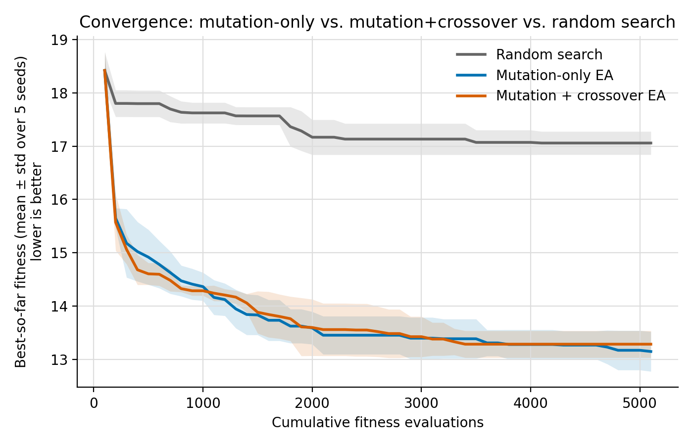
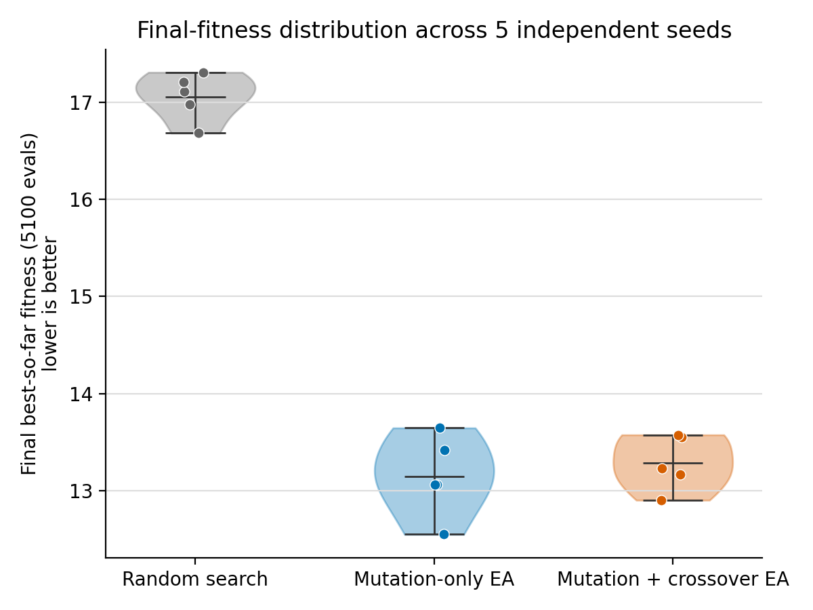
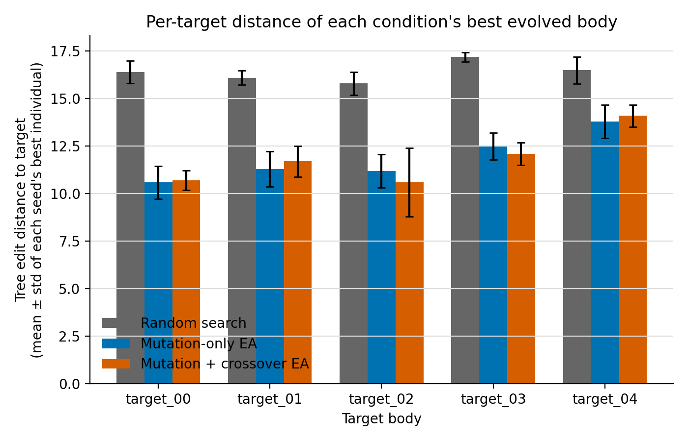
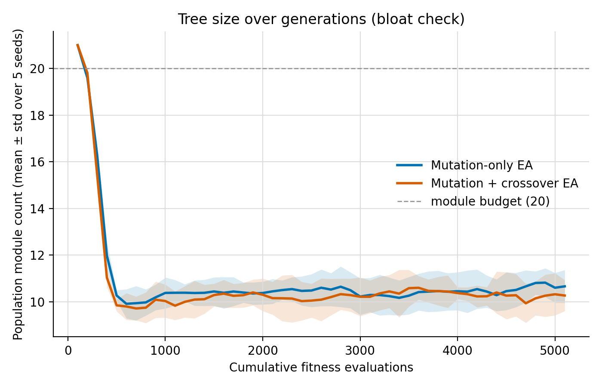
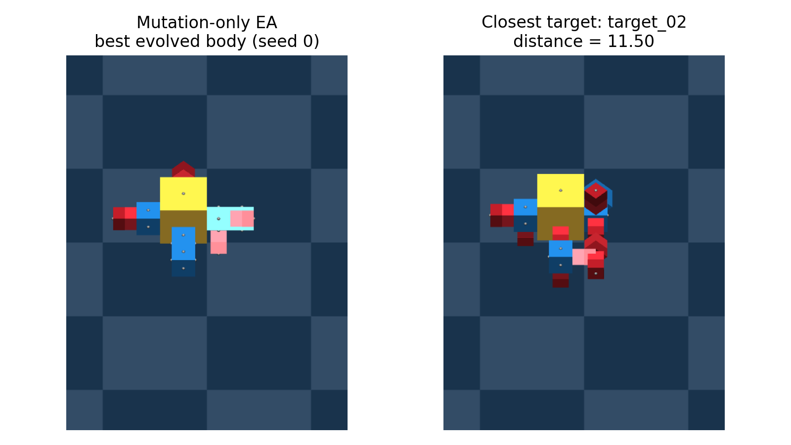
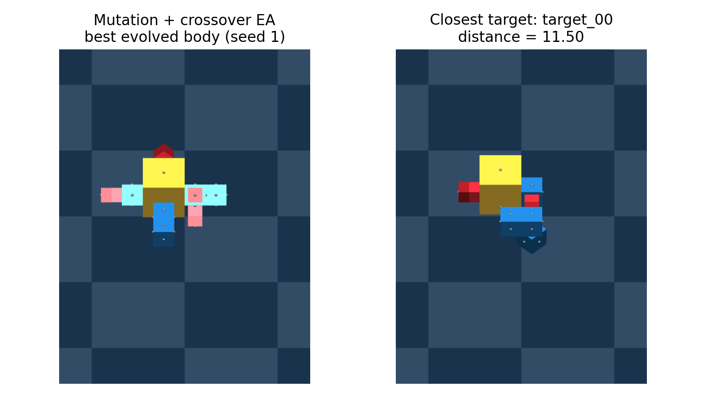
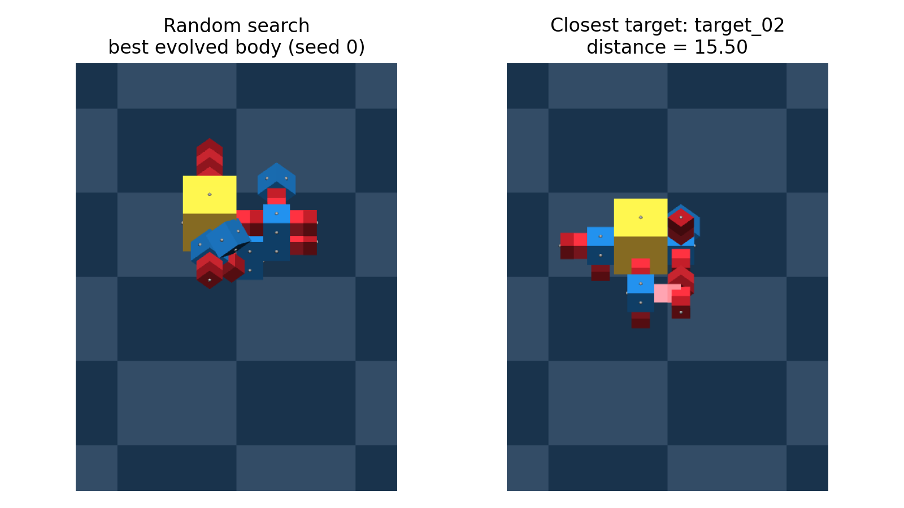

# Results: mutation-only vs. mutation+crossover vs. random search

Derived output from `analyze_results.py` and `render_bodies.py`, computed over
5 independent seeds per condition, all three at the same 5100-evaluation
budget (pop size 100 × 51 generations for the EA variants). Raw per-individual
logs live in `../__data__/` (SQLite for the EA runs, CSV for random search)
and are never modified by these scripts.

## Folder structure

```
__results__/
├── plots/       all figures below (PNG)
├── tables/      the CSV data behind every figure
└── manifests/   best_individuals.json - handoff file from analyze_results.py
                 to render_bodies.py (each condition's single best genome +
                 its closest target); not a report artifact on its own
```

To regenerate everything from scratch:

```bash
python analyze_results.py   # writes plots/ + tables/ + manifests/
python render_bodies.py     # reads manifests/, writes the render_*.png plots
```

| Table | Contents |
|---|---|
| `tables/generation_summary.csv` | Per-seed, per-generation population mean/std fitness and best-so-far |
| `tables/condition_summary.csv` | The above, aggregated (mean/std) across the 5 seeds per condition |
| `tables/convergence_speed.csv` | Per-seed evaluations needed to reach the shared convergence threshold |
| `tables/per_target_distance.csv` | Per-seed, per-target distance of each seed's best individual |
| `tables/tree_size_summary.csv` | Per-seed, per-generation population module count (EA variants only) |

---

## Figure 1: headline results, at a glance

<table>
<tr>
<td width="50%">



**(a) Convergence.** Best-so-far fitness (mean ± std, 5 seeds) vs. cumulative
evaluations, all three conditions on one shared x-axis. Both EA variants
crash from the shared random-init fitness (~18.4) to their final range
within ~500 evaluations and are visually indistinguishable from each other
thereafter. Random search improves far more slowly and plateaus at ~17.1,
never reaching the ~13.8 threshold either EA crosses. Final fitness: 13.15 ±
0.37 / 13.28 ± 0.25 / 17.06 ± 0.22 (lower is better).

</td>
<td width="50%">



**(b) Final-fitness distribution.** The same final-generation values as (a),
shown as a distribution with the 5 raw seed points overlaid (a violin alone
can mislead at n=5). Mutation-only and mutation+crossover overlap almost
completely (~13.0–13.6, seed values interleaved between the two); random
search is a fully separate, non-overlapping cluster (~16.7–17.3) - the
clearest visual evidence that the crossover question is a genuine null
result here, not an averaging artifact.

</td>
</tr>
<tr>
<td width="50%">



**(c) Per-target distance.** Each condition's best individual (across all 5
seeds), decomposed into its distance to each of the 5 targets individually
rather than the combined mean+std fitness scalar. Both EA variants land in
the same ~10.6–14.1 range across every target - improvement is spread evenly
rather than nailing one target while ignoring the rest. `target_03` and
`target_04` are consistently hardest for every condition, including random
search, suggesting they're structurally harder to reach regardless of which
algorithm is searching.

</td>
<td width="50%">



**(d) Tree size (bloat check).** Population module count (mean ± std, 5
seeds) per generation, EA variants only. Both collapse from the initial
random population's ~20-21 modules down to a stable ~10 within the first few
hundred evaluations, then hold flat. There is **no bloat**, and no
difference in size-drift between mutation-only and mutation+crossover -
confirming tree size isn't a confound in the fitness comparison above,
despite crossover's subtree swaps being able to change size directly.

</td>
</tr>
</table>

---

## Best-body renders (qualitative check)

Each condition's single best evolved body (across all 5 seeds), rendered
next to its closest target body. Purely qualitative - a fitness number going
down is not by itself evidence the bodies look anything like the targets,
so this is the direct visual check.

<table>
<tr>
<td width="33%">



**(a) Mutation-only.**

</td>
<td width="33%">



**(b) Mutation+crossover.**

</td>
<td width="33%">



**(c) Random search.**

</td>
</tr>
</table>

**Reading it:** both EA variants' best bodies are visibly close matches to
their target - same core module, same hinge placement, same rough silhouette
(distance ≈ 11.5 for both). Random search's best body shares the same "parts
palette" as its target but is visibly messier and less organized (distance
≈ 15.5) - consistent with, and a good sanity check on, the ~4-point gap seen
numerically everywhere else in this analysis.
