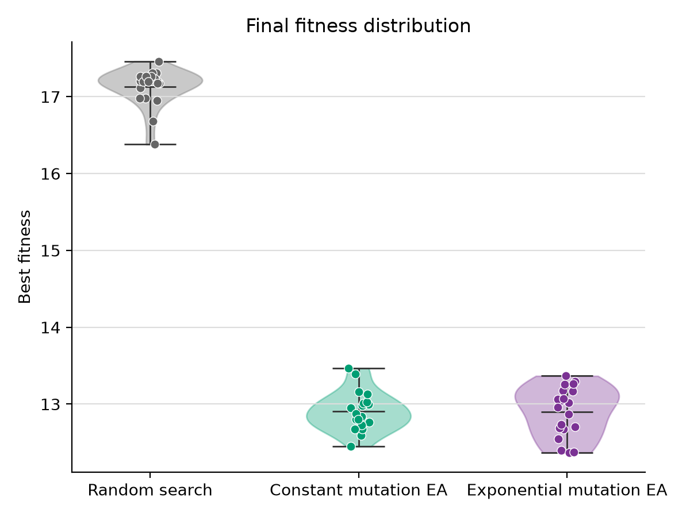
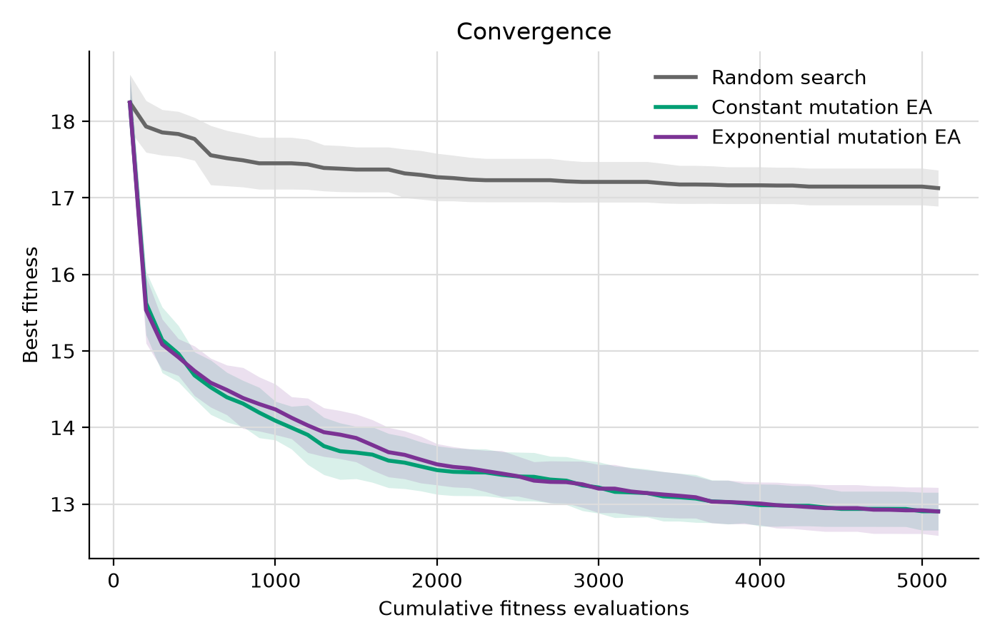
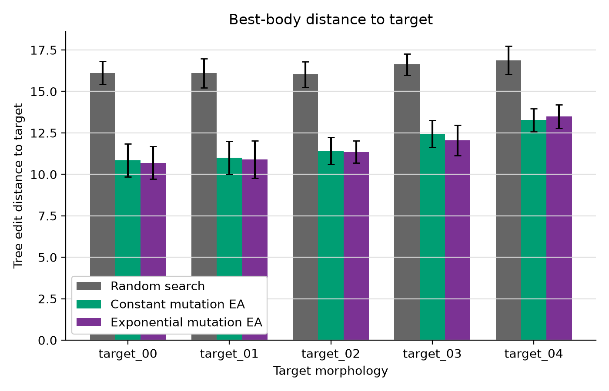
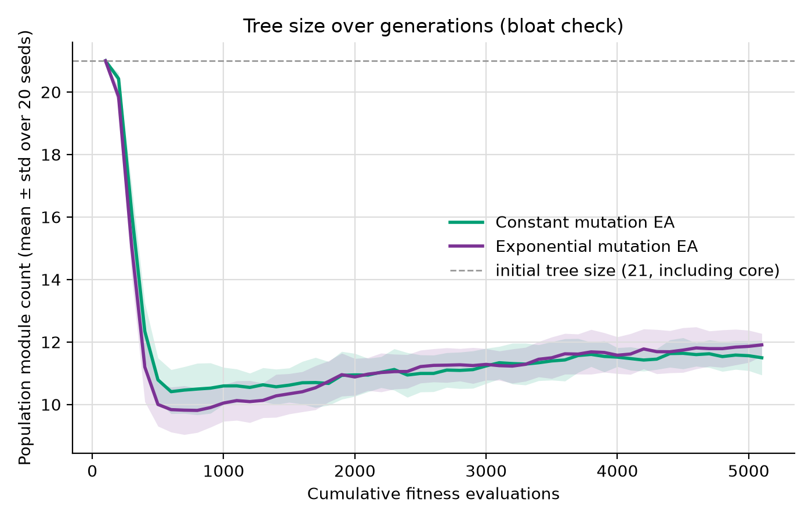
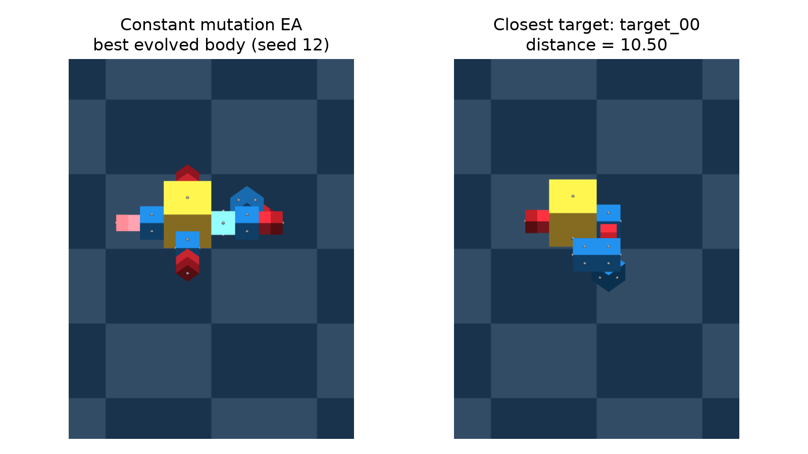
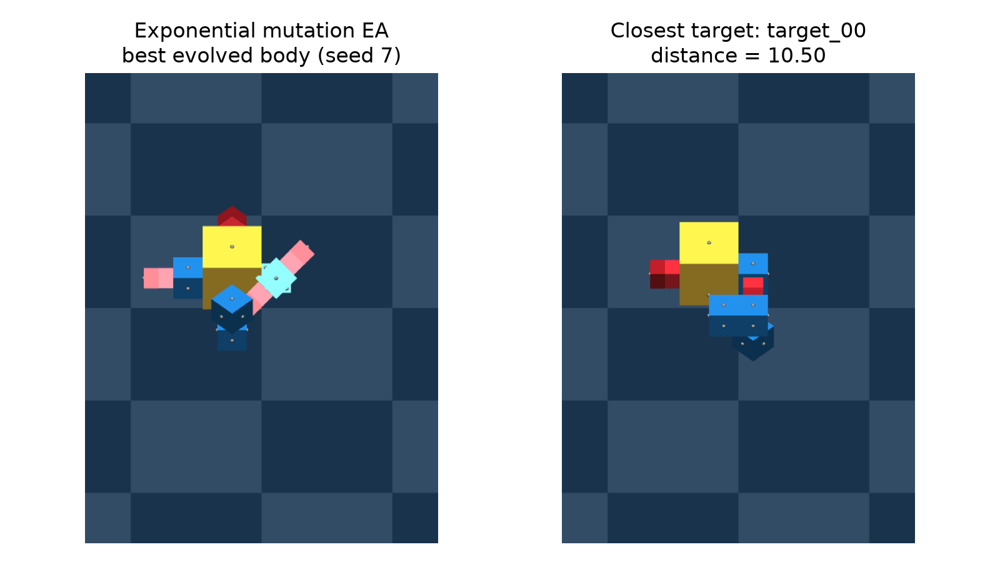
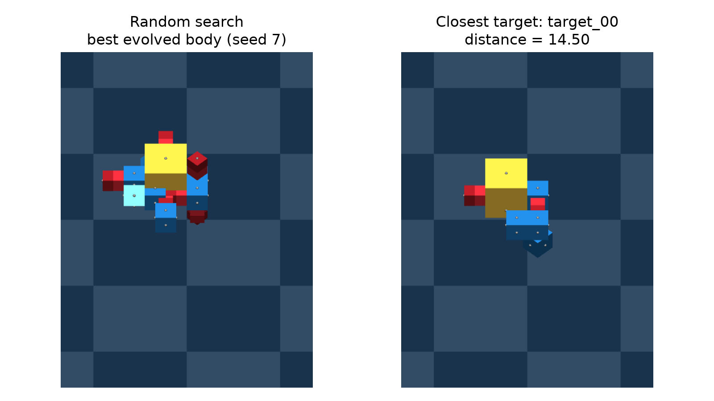

# Results: constant vs. exponentially decreasing mutation

## Research question and design

How does an exponentially decreasing mutation rate, compared with a constant
mutation rate, affect a crossover-based EA for evolving robot morphologies
under the same evaluation budget?

The hypothesis is that more mutation early and less mutation late may improve
search. To separate mutation timing from its expected total amount, the
constant probability is the arithmetic mean of the exponential probabilities.
**No clear performance advantage was observed under this setup.** The final
means are almost identical, and each EA wins 10 of the 20 matched seeds.

These are actual results from 60 completed runs: seeds **0 through 19** for
each of constant mutation, exponential mutation, and random search. No results
from the historical crossover/no-crossover experiment are included.

### Schedules

The supplied `exponential_mutation_rate()` function is unchanged. For
schedule index `i = 0, ..., G-1`:

```text
p_exp(i) = start * (end / start) ** (i / (G - 1))
p_constant = sum(p_exp(i) for i in range(G)) / G
offspring_generation = i + 1
```

For this experiment, `G=50`, `start=0.8`, and `end=0.2`:

- Offspring generation 1 uses index 0 and probability **0.8**.
- Offspring generation 50 uses index 49 and probability **0.2**.
- The calculated constant probability is **0.43418063336559626**.
- Expected mutation attempts per run are **2170.9031668279813** in either EA:
  `100 * sum(rates) = 100 * 50 * p_constant`.

[mutation_schedule.csv](mutation_schedule.csv) records all 50 probabilities and
the explicit generation mapping. Each raw EA run also contains its actual
probability sequence and attempt counts in `generation_log.csv`.

A mutation probability gates one call to the existing `repaired_mutate()`
per offspring. It does not guarantee a changed phenotype. Internal retries,
operator no-ops, and fallback behavior are preserved.

### Shared settings

| Setting | Value |
|---|---|
| Representation | ARIEL TreeGenome, decoded directly to a phenotype DiGraph |
| Population | 100 |
| Offspring generations | 50 |
| Objective evaluations per run | 100 initial + 50 x 100 offspring = **5100** |
| Independent runs per condition | 20, seeds 0-19 |
| Parent selection | Tournament size 3; lower fitness wins |
| Crossover | Existing repaired subtree crossover, always invoked in both EAs |
| Mutation operator mixture | 50/50 node replacement / subtree replacement |
| Replacement | Full generational replacement; no elitism |
| Maximum depth | 12, including rejection of over-depth initial samples |
| Initialization | 20 non-core modules plus one core: **21 nodes** |
| Fitness | Supplied weighted tree-edit distance: mean + population std over all five targets |
| Direction | Minimization |

Insertion, deletion, and type mismatch cost 1.0; rotation mismatch costs 0.5.
Target sizes are 7, 11, 15, 19, and 25 nodes. The metric and targets are unchanged.

Random search independently samples the **depth-valid EA initialization
distribution** for 5100 evaluations. It does not sample the EA's full reachable
variable-size domain. All 20 matched EA pairs have identical generation-0
genomes and fitness values. Their later RNG streams are allowed to diverge.

## Outputs and pipeline

The existing runners, analysis script, and renderer were reused. No new Python
source files or launcher scripts were created. Historical `__results__`, its
README, the assignment template, and ARIEL source were preserved.

```text
results_dynamic_scheduler/
    README.md
    mutation_schedule.csv
    tables/
    plots/
    manifests/
```

| Output | Contents |
|---|---|
| [generation_summary.csv](tables/generation_summary.csv) | 3060 per-seed checkpoint rows: population mean/std and best-so-far |
| [condition_summary.csv](tables/condition_summary.csv) | Mean/std of best-so-far across 20 runs |
| [final_fitness_summary.csv](tables/final_fitness_summary.csv) | Final best-so-far mean, std, median, minimum, maximum |
| [convergence_speed.csv](tables/convergence_speed.csv) | First checkpoint reaching the shared descriptive threshold |
| [paired_differences.csv](tables/paired_differences.csv) | Exponential minus constant for each matched seed |
| [paired_summary.json](tables/paired_summary.json) | Paired descriptive statistics and Wilcoxon result |
| [per_target_distance.csv](tables/per_target_distance.csv) | Five distances for each seed's best body; 300 rows |
| [tree_size_summary.csv](tables/tree_size_summary.csv) | 2040 per-seed EA population-size checkpoints |
| [best_individuals.json](manifests/best_individuals.json) | Best overall body per condition and its closest target |
| [execution_manifest.json](manifests/execution_manifest.json) | Exact execution commands, timings, environment, source/target hashes |
| [smoke_report.json](manifests/smoke_report.json) | Pre-batch smoke-test results |
| [validation_report.json](manifests/validation_report.json) | Checks of all completed raw runs |
| [preservation_report.json](manifests/preservation_report.json) | Historical-file and source-scope checks |

Raw output locations, relative to `assignment_1`:

```text
__data__/ea/dynamic_constant/seed_N/
    database.db
    metadata.json
    generation_log.csv
__data__/ea/dynamic_exponential/seed_N/
    database.db
    metadata.json
    generation_log.csv
__data__/random_search_dynamic_scheduler/seed_N/
    results.csv
    best_genome.json
    metadata.json
__data__/dynamic_scheduler_support/
    execution_manifest.json
    validation_report.json
    run_logs/
__data__/dynamic_scheduler_smoke/
    ... isolated smoke-test data ...
```

The repository's existing ignore rules exclude raw `__data__` and these new PNG
outputs from ordinary Git tracking. They are present locally; include them
explicitly when packaging the experiment.

## Final best-so-far fitness

| Condition | Mean | Std | Median | Minimum | Maximum |
|---|---:|---:|---:|---:|---:|
| Constant mutation | 12.905212 | 0.246997 | 12.859600 | 12.448683 | 13.467708 |
| Exponential mutation | 12.902022 | 0.313511 | 12.988950 | 12.369536 | 13.366190 |
| Random search | 17.126858 | 0.235418 | 17.200000 | 16.378233 | 17.460233 |

All standard deviations in the descriptive tables and plot bands use
`ddof=0`. Bands are standard deviations, not confidence intervals.
The endpoint is the best body found anywhere within the evaluation budget,
not necessarily a survivor in the final generation. Keeping a historical
best for reporting does not add elitism to the EA.



The final-fitness distributions overlap substantially. Exponential mutation
has a slightly better mean and best observed individual, but a worse median
and larger observed spread. Neither the selected best run nor this tiny mean
difference establishes a general advantage.

### Paired comparison

For each seed:

```text
delta = final_best_exponential - final_best_constant
negative: exponential wins; positive: constant wins
```

- Mean difference: **-0.003190260**.
- Median difference: **-0.038748763**.
- Standard deviation of differences: **0.380739925**.
- Exponential wins: **10**; constant wins: **10**; ties: **0**.
- Two-sided Wilcoxon signed-rank test: **W=100.0, p=0.8694877625**.

The installed SciPy 1.16.2 was used with `zero_method="wilcox"` and
`method="auto"`. Differences were rounded to 12 decimal places for the rank
test only, to avoid numerical pseudo-ties; the CSV retains unrounded
differences. No additional dependency was installed.

This comparison did not detect a clear final-fitness advantage. The p-value
does not establish equivalence or rule out smaller effects.

## Convergence



| Evaluations | Constant | Exponential | Random search |
|---:|---:|---:|---:|
| 100 | 18.245128 | 18.245128 | 18.245128 |
| 500 | 14.680688 | 14.738715 | 17.769256 |
| 1000 | 14.088608 | 14.236048 | 17.451209 |
| 2000 | 13.442462 | 13.518200 | 17.269788 |
| 3000 | 13.215037 | 13.200863 | 17.208075 |
| 4000 | 12.985137 | 13.005562 | 17.163668 |
| 5100 | 12.905212 | 12.902022 | 17.126858 |

Both EAs improve rapidly at first and continue improving later. Constant
mutation has a somewhat lower mean at some early checkpoints; the curves
are very close later. There is no consistent convergence advantage for the
decreasing schedule across these checkpoints.

The reused convergence-speed analysis uses a descriptive, post-hoc threshold
of **13.5471**, equal to 1.05 times the better final EA mean. All 20 runs in
each EA condition reach it. Both have a median first crossing at **1900
evaluations**. Ranges are 1100-4200 for constant and 800-3700 for exponential.
No random-search run reaches it. Crossings are measured at 100-evaluation
checkpoints, not at exact within-generation evaluation times.

Generation 0 is the initial population; cumulative evaluations at generation
`g` are `(g + 1) * 100`.

## Per-target behavior



These bars average the best individual from **each of the 20 seeds**, not
one selected overall winner.

| Target | Constant mean distance | Exponential mean distance | Random-search mean distance |
|---|---:|---:|---:|
| target_00 | 10.850 | 10.700 | 16.125 |
| target_01 | 11.000 | 10.900 | 16.100 |
| target_02 | 11.425 | 11.350 | 16.025 |
| target_03 | 12.450 | 12.050 | 16.625 |
| target_04 | 13.275 | 13.500 | 16.875 |

Exponential mutation has lower average distances to the first four targets,
but a higher distance to target_04. The aggregate objective therefore reflects
a compromise rather than improvement against every target. Target_04 is also
the largest target; these unnormalized distances do not establish that it is
intrinsically harder independently of size.

## Tree size / bloat



Both EAs start at exactly 21 nodes and shrink rapidly toward roughly 10 nodes.
Their population means then increase gradually. At the final generation:

- Constant: **11.496 +/- 0.552 nodes** across the 20 population means.
- Exponential: **11.908 +/- 0.363 nodes** across the 20 population means.

There is no runaway growth in the population-average size over this budget,
but there is modest regrowth after the initial collapse. Similar averages do
not establish identical size distributions. The 21-node dashed reference
marks initialization size, not a hard evolved-size limit; the enforced
constraint is depth 12. Both existing mutation operators can shrink trees.

## Best-body renders

Each render shows the single best observed body in a condition alongside its
closest target. This is a selected example, not a typical-run performance
estimate.

| Condition | Best seed | Nodes | Objective fitness | Closest target | Distance to that target |
|---|---:|---:|---:|---|---:|
| Constant | 12 | 13 | 12.448683 | target_00 | 10.5 |
| Exponential | 7 | 13 | 12.369536 | target_00 | 10.5 |
| Random search | 7 | 21 | 16.378233 | target_00 | 14.5 |







The two selected EA bodies are compact 13-node compromises with different
branch arrangements. Both are visibly different from the seven-node nearest
target; the renders should not be described as exact or near-exact matches.
Random search's selected body retains its required 21 nodes.

The supplied metric uses attachment faces to order children, without a separate
face-relabel penalty. Fitness is consequently a structural proxy rather than
a complete geometric measure. No locomotion, controller performance, or
collision-free physical viability was optimized.

## Validation, interpretation, and limitations

Before the batch, smoke checks covered schedule endpoints and mean matching,
generation indexing, identical initialization, crossover in both conditions,
open/closed mutation gates, depth rejection, and historical CLI compatibility.
A real ARIEL run with a cheap test objective verified the complete
100 + 50 x 100 evaluation accounting; those isolated smoke records are not
part of this experiment's results.

After the batch, all **306000 objective evaluations** were accounted for.
Every EA database contains 100 evaluated individuals at each generation 0-50,
5000 dead historical individuals, and 100 final survivors. All 20 paired
initial populations matched exactly. The 4000 initial and 4000 final EA
genomes checked met depth and structural validation. Each random-search log
has 5100 consecutive evaluation indices and a correct cumulative minimum.
Saved winning genomes were checked against the objective.

Expected mutation attempts were matched, but realized counts need not match:

| Condition | Mean actual attempts | Std | Minimum | Maximum |
|---|---:|---:|---:|---:|
| Constant | 2153.05 | 39.751 | 2084 | 2233 |
| Exponential | 2174.10 | 28.705 | 2119 | 2236 |

These count per-offspring mutation gates, not successful phenotype changes or
internal repair retries. Different effective mutation outcomes and tree-size
trajectories are possible consequences of the schedule.

Both EAs outperform the specified fixed-size initialization-distribution
baseline in these runs. That comparison does not establish superiority over
random search across the full variable-size domain.

The findings concern this target set, representation, operator mix, schedule
endpoints, and budget. Twenty runs improve the descriptive evidence but do
not establish equivalence. **No clear performance advantage from exponential
mutation scheduling was observed under this setup.**

## Reproduce the pipeline

From the repository root, in PowerShell with the existing environment:

```powershell
$python = (Resolve-Path ".venv/Scripts/python.exe").Path
$a1 = (Resolve-Path "assignments/assignment_1").Path
$env:PYTHONDONTWRITEBYTECODE = "1"
$env:MPLCONFIGDIR = Join-Path $a1 "__data__/dynamic_scheduler_support/matplotlib"
$env:OPENBLAS_NUM_THREADS = "1"
$env:OMP_NUM_THREADS = "1"
$env:MKL_NUM_THREADS = "1"

foreach ($seed in 0..19) {
    & $python -B "$a1/run_ea.py" --seed $seed --mutation-schedule constant
    if ($LASTEXITCODE -ne 0) { throw "Constant run failed: seed $seed" }
    & $python -B "$a1/run_ea.py" --seed $seed --mutation-schedule exponential
    if ($LASTEXITCODE -ne 0) { throw "Exponential run failed: seed $seed" }
    & $python -B "$a1/run_random_search.py" --seed $seed --dynamic-scheduler
    if ($LASTEXITCODE -ne 0) { throw "Random-search run failed: seed $seed" }
}
& $python -B "$a1/analyze_results.py" --experiment dynamic
if ($LASTEXITCODE -ne 0) { throw "Analysis failed" }
& $python -B "$a1/render_bodies.py" --experiment dynamic
if ($LASTEXITCODE -ne 0) { throw "Rendering failed" }
```

These are the same per-run commands used for this batch; six independent
processes were run concurrently to reduce wall time. The execution manifest
records every exact command. The batch took approximately **21.38 minutes**,
excluding smoke tests, analysis, and rendering.

The runner commands require fresh new-experiment output directories and refuse
to overwrite an existing new run. On this already-completed checkout, use just
the last two commands to regenerate the new analysis and renders. Do not delete
historical output to rerun the experiment. The old no-argument analysis and
rendering modes remain available for the historical experiment.

Environment: Python 3.12.9, NumPy 2.3.3, NetworkX 3.5, MuJoCo 3.8.0,
SQLModel 0.0.27, SQLAlchemy 2.0.43, SciPy 1.16.2, Matplotlib 3.10.7.
The README describes this completed batch; update its interpretation if data
or experimental settings change.
